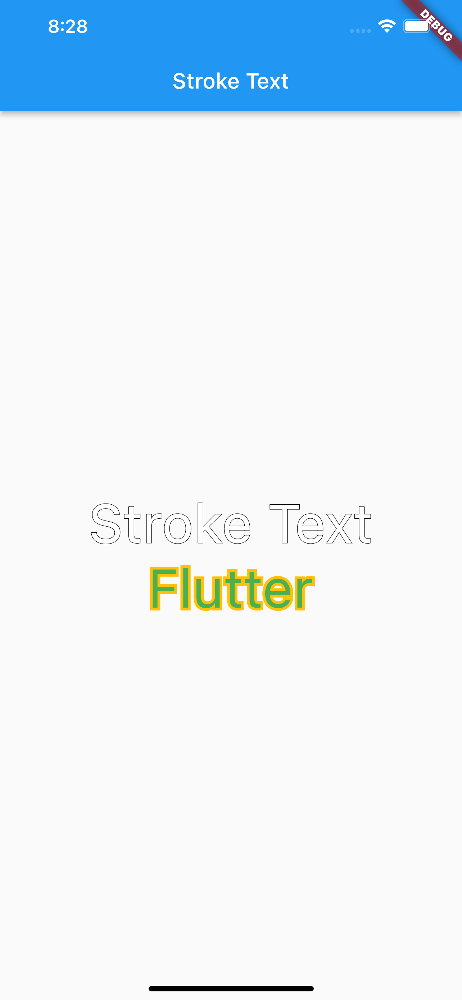

Stroke Text Widget
=====
A simple flutter package to add stroke (border) style to a text widget


Installation
-----
1. Add this to your package's `pubspec.yaml` file:

```yaml
dependencies:
  stroke_text: any
```

1. Get the package using your IDE's GUI or via command line with

```bash
$ pub get
```

1. Import the `color.dart` file in your app

```dart
import 'package:stroke_text/stroke_text.dart';
```

Usage
-----
default text widget
```dart
StrokeText(text: "Stroke Text",)
```
custom text style
```dart
StrokeText(
  text: "Stroke Text",
  textStyle: TextStyle(
    fontSize: 50
  ),
),

StrokeText(
  text: "Flutter",
  textStyle: TextStyle(
    fontSize: 50,
    color: Colors.green
  ),
  strokeColor: Colors.amber,
  strokeWidth: 5,
),
```


## Screenshots

